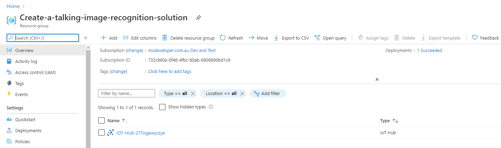

# Module 1: Create an Azure IoT Hub

---

## Index

* Module 1: [Create an Azure IoT Hub](../module_1_create_iot_hub/README.md)
* Module 2: [Install Azure IoT Edge on your Raspberry Pi](../module_2_install_azure_iot_edge/README.md)
* Module 3: [Set up your development environment](../module_3_set_up_computer/README.md)
* Module 4: [Create Azure Cognitive Services](../module_4_create_azure_resources/README.md)
* Module 5: [Build and deploy the solution](../module_5_building_the_solution/README.md)
* Module 6: [Build and deploy the solution](../module_6_camera_settings/README.md)

* [Home](../../README.md)

---

## Create an Azure Subscription

If you do not have an Azure Subscription then [create an Azure Subscription](https://azure.microsoft.com/en-us/free/?WT.mc_id=julyot-tir-dglover). Students can sign up for a free [Azure for Students](https://azure.microsoft.com/en-us/free/students/?WT.mc_id=julyot-tir-dglover) subscription that does not require credit card verification.

---

## Prepare Azure resources

You can prepare Azure cloud resources with the Azure CLI, the Azure Portal Web interface, or deployment templates. For this module, we will be using an Azure deployment template.

Click the **Deploy to Azure** button to deploy Azure resources. An IoT Hub will be created.

1. Select or create a new resource group, choose the site located closest to you, and select the IoT Hub Tier. The default IoT Hub tier is the free **F1** tier. You can only have one free IoT Hub per subscription. If you already have a free IoT Hub then either select S1 ([pricing](https://azure.microsoft.com/en-us/pricing/details/iot-hub/?WT.mc_id=julyot-tir-dglover)) or delete your existing free IoT Hub before proceeding.

    

2. Click **Next**.
3. Click **Deploy**. The deployment will take three to four minutes to complete.

    

4. When the deployment has completed, click on **Manage your resources**. You will see the IoT Hub listed in the Azure Web Portal.

    

5. Click on the IoT Hub resource created to open it.
6. From the IoT Hub blade, select **IoT Edge** from the IoT Hub blade sidebar menu
7. Click **+ New**
8. In the **Device ID** dialogue box, name your device **rpi-edge-device**.
9. Click **Save**. This will create the device.
10. Click on the newly create IoT Edge device
11. Click the **Copy** icon to the right of the **Primary Connection String** field and save to Notepad or a text edit on your Operating System as you will need this connection string when configuring your Iot Edge device.
    

---

**[NEXT](../module_2_install_azure_iot_edge/README.md)**

---
